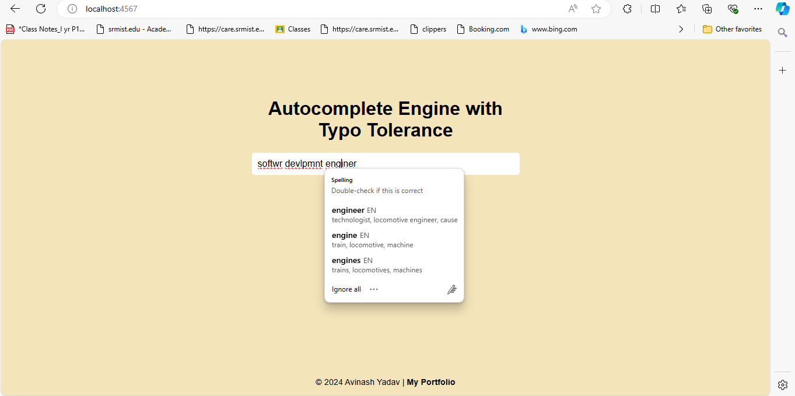

# Autocomplete-Engine-with-Typo-Tolerance



## Table of Contents

- [Overview](#overview)
- [Motivation](#motivation)
- [Features](#features)
- [Challenges Faced](#challenges-faced)
- [Outcome of the Project](#outcome-of-the-project)
- [Why This Project?](#why-this-project)
- [Tech Stack](#tech-stack)
- [Steps to Run the Project](#steps-to-run-the-project)
- [How It’s Different from Other Projects](#how-its-different-from-other-projects)
- [Contributing](#contributing)
- [License](#license)

## Overview

This project is an **Autocomplete Engine with Typo Tolerance**, built using **Java**, **Spark Java framework** for backend, **Gson** for JSON handling, and basic HTML, CSS, and JavaScript for the frontend. The engine provides **real-time autocomplete suggestions** and even accounts for minor typos, offering suggestions similar to what the user might intend.

The backend uses **Trie** data structures for efficient word lookup and **Levenshtein Distance** (Edit Distance) algorithm to handle typos and find the closest match.

## Motivation

Autocomplete engines are integral to modern search experiences, from search engines like Google to basic form fields. What makes this project stand out is the added **typo tolerance** — a feature that significantly enhances user experience. This ensures that the user doesn’t need to be precise, making the application forgiving to spelling errors.

## Features

- **Real-time Autocomplete Suggestions**: As the user types, suggestions are displayed in real-time based on the input.
- **Typo Tolerance**: The engine suggests similar words even when the user makes small spelling mistakes.
- **Efficient Search**: Uses Tries to achieve fast prefix-based lookups.
- **Dynamic Frontend**: The frontend dynamically updates the list of suggestions.
- **Backend API**: The backend API serves real-time suggestions using JSON.

## Challenges Faced

1. **Efficient Typo Tolerance**: Handling typographical errors in real-time without sacrificing performance was a significant challenge. By implementing the Levenshtein Distance algorithm using dynamic programming, we were able to find the closest matches efficiently.
   
2. **Trie Optimization**: Storing large dictionaries in memory while keeping memory usage and time complexity low required optimizing the Trie data structure.

3. **Real-time Updates**: Ensuring that the frontend reflects backend results in real-time required carefully structuring the asynchronous JavaScript code to prevent delays or UI freezes.

4. **Cross-browser Compatibility**: Ensuring the UI and interaction work consistently across different browsers like Chrome and Edge.

## Outcome of the Project

The **Autocomplete Engine with Typo Tolerance** performs efficiently with small to medium-sized datasets (such as common dictionaries). It provides users with immediate feedback as they type, even allowing for minor spelling errors. This project showcases the application of **Data Structures and Algorithms (DSA)**, specifically Tries, HashMaps, and Dynamic Programming.

## Why This Project?

Autocomplete is essential in many applications, but many solutions fail when faced with minor typing errors. This project caters to this gap by adding **typo tolerance**, improving the user experience.

- **User Experience Enhancement**: Typo tolerance ensures that users aren’t frustrated by having to type precisely.
- **Scalability**: The solution can be extended to support more complex datasets or even full-text search engines.

## Tech Stack

- **Java**: For implementing backend logic.
- **Spark Java Framework**: For building the RESTful API that serves autocomplete suggestions.
- **Gson**: For handling JSON data in the API responses.
- **Trie Data Structure**: For efficient autocomplete lookup.
- **Levenshtein Distance Algorithm**: For typo tolerance.
- **HTML/CSS/JavaScript**: For building the frontend interface.
- **Maven**: For managing dependencies and building the project.

## Steps to Run the Project

### Prerequisites

- **Java** (version 8+)
- **Maven** (for dependency management)
- **A browser** (to access the frontend)

### 1. Clone the repository

```bash
git clone https://github.com/yourusername/autocomplete-engine.git
cd autocomplete-engine


### 2. Install dependencies
Make sure Maven is installed, then run:

```bash
Copy code
mvn clean install
This will download all dependencies, including spark-core and gson.

### 3. Run the backend
```bash

mvn exec:java -Dexec.mainClass="com.autocomplete.AutocompleteService"
This command starts the backend server, which will be listening on localhost:4567.

### 4. Open the frontend
Open the public/index.html file in any web browser to access the user interface.

For a local setup, you can open index.html by navigating to the public directory and double-clicking the file.

Alternatively, host the frontend using a web server or on GitHub Pages for live deployment.

### 5. Test Autocomplete
Start typing in the input box and watch the suggestions populate in real time.

### 6. Handling Typos
Make a small typo (e.g., typing "aple" instead of "apple"), and observe how the engine still provides relevant suggestions.

## How It’s Different from Other Projects
-**Typo Tolerance**: Unlike basic autocomplete engines, this project introduces error correction by leveraging the Levenshtein Distance algorithm. Many autocomplete projects focus only on prefix matching, but here the user can make small mistakes and still get relevant suggestions.

-**Efficient Data Structures**: The use of a Trie data structure enhances search efficiency and scalability.

- **Real-time Performance**: While typo correction algorithms are generally computationally expensive, this project is optimized for real-time performance, handling user input quickly and accurately.

- **Simple Yet Powerful**: The combination of Java, Spark, and HTML/CSS/JavaScript makes the project accessible to developers while still demonstrating complex DSA concepts.

- **End-to-End Solution**: This project isn’t just about the algorithm. It includes a full-stack approach with both frontend and backend components, making it an excellent showcase for FAANG interviews where systems and scalability are key topics.

### Contributing
Feel free to fork the repository and submit pull requests for any improvements. Contributions are welcome, especially around optimization or extending the typo-tolerance capabilities.

### License
This project is licensed under the MIT License. See the LICENSE file for details.


